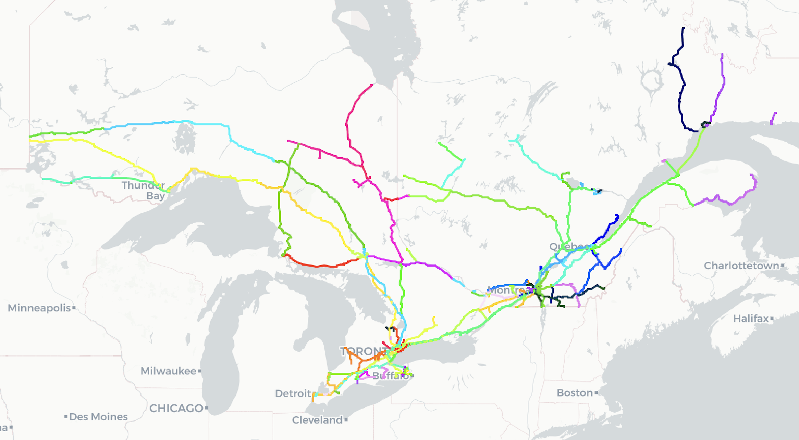
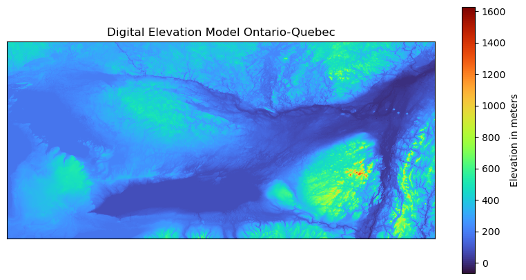

# motion_planning_trains

Simulation of trains moving through Ontario and Quebec and their fuel consumption using DEM (Digital Elevation Model). The goal of this project is to develop a very basic algorithm for fuel consumption optimization.

Below is a detailed walkthrough of the steps of this project. A couple of things to clear up before we move forward:
- Some of the files I used in my local repo are not here due to their size, such as a PostGIS database with DEM tiles (4.39 GB) or even a relatively small Shape file for Ontario's Rail Network (45 MB). Github restricts everything over 25 MB. Overcoming this obstacle is not super complicated, however, this is not a priority right now. I will provide all of the links for downloading the necessary data.
- The repo is in an active phase of work, so it is a bit messy and incomplete (next steps for your reference). I will try to be as clear as possible in the readme.
- It's not something professional or really useful at this point, just me playing with stuff :)

My step-by-step process:
1. Downloaded Quebec Railway Network dataset from here (https://open.canada.ca/data/en/dataset/c2c4f386-a736-4eaa-b5b6-28c3a8f75466). It's the second package in the list, "Railway network", in Geojson format ("ReseauFerroviaire.geojson" in the repo).
2. Got similar data for Ontario here (https://geohub.lio.gov.on.ca/maps/mnrf::ontario-railway-network-orwn/about). It's the first package in the list, "ORWN Track", in Shapefile format (not in the repo due to size).
3. Downloaded Digital Elevation Model (DEM) for the Area of Interest (AOI). I used data from here (https://portal.opentopography.org/raster?opentopoID=OTNED.012021.4269.2) with Bounding Box (BBox): Xmin, Ymin, Xmax, Ymax = -81.82339, 42.666088, -72.224913, 47.067488. More notes about it are in the Jupyter Notebook "tracks_and_elevation.ipynb" when I plot it (near the end of it).
4. Explored ON and QC track datasets, aligned CRSs, plotted tracks on interactive maps, and plotted DEM in "tracks_and_elevation.ipynb". Here are two quick visualizations: train tracks and DEM (the blue thing below the center is Lake Ontario).

5. Exported all the tracks from geopandas dataframe into Geojson file "tracks.geojson".
6. Created PostGIS database from TIF image from step 3. I cut it into tiles 100x100 pixels for faster work (it's better to reference a track to a few small tiles than to the whole area). The code for it is in "db_from_raster.sh".
7. Queried PostGIS database with just a couple of simple SQL queries in "DEM.session.sql".
8. Put these SQL queries in a new Jupyter Notebook "motion_planning.ipynb" as f strings. Further in that notebook, I plan to combine raster and vector data and build a model for fuel consumption optimization based on elevation.

Next steps:
- Transfer vector track data to an already created table in the PostGIS db "elev.sql".
- Through PostGIS functions find where tracks cross pixels of DEM (the key is to align properly both CRSs).
- Store this data in a separate table in "elev.sql".
- Build a simple simulation of fuel consumption.
- Train a Reinforcement Learning model to reduce it.
